## **How to install and setup Prestashop on AWS**

PrestaShop is an open-source E-Commence platform that is free to use. It is one of the most popular E-Commence website builder platforms and has an intuitive interface that makes it easy to manage your online store.

PrestaShop is easy to use and offers a responsive store interface for shoppers. Prestashop It provides a complete set of features free of cost.

## Requirements to install Prestashop:

- Ubuntu 20.04 0r higher
- System Requirements 1GB of RAM, 2 CPU Cores, 1 GB of Disk space
- Apache2 Webserver which  is one of the most popular web servers in the world.
- AWS RDS Instance (MYSQL) 5.0 or higher: MYSQL is a popular database management system used within PHP environments
- PHP7.4 which is a general-purpose open-source scripting language and one of the most popular programming languages for web development

## Step 1: Create a publicly accessible MYSQL database in RDS

We need to create a publicly accessible RDS instance with minimal cost to hold our application data

## Security Group for MYSQL traffic

- On AWS Management Console navigate to `EC2` > `Security Groups` > `Create security group`

- Add an inbound rule for `MYSQL` from `Anywhere` (basically Protocol: `TCP`, Port: `3306`, Source: `0.0.0.0/0`)

  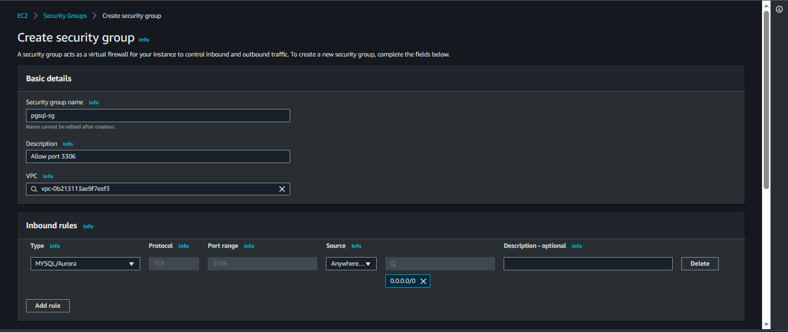

- Leave everything else as it's and click create

## Create an RDS Instance

**Please follow this section very carefully to avoid DB problems in the upcoming stages**

- On AWS Management Console navigate to `RDS` > `Databases` > `Create database`

- In the first card choose `Standard Create`, and in **Engine** options choose `MYSQL` with the **default** version

  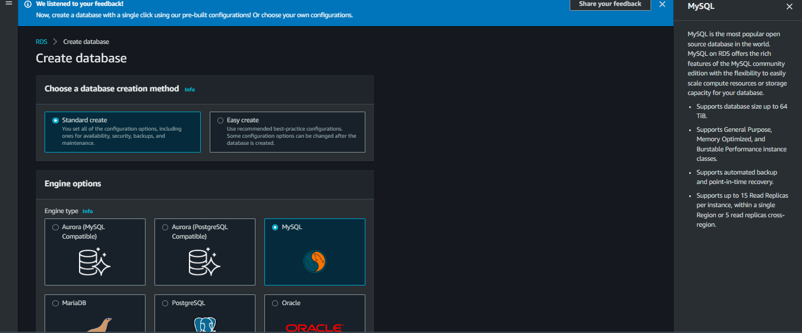

- In **Templates** choose `Free tier`, and you'll see that you're restricted to `Single DB instance` in the next card

  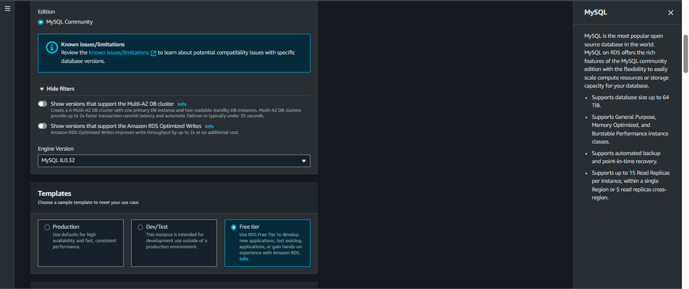

- In Settings choose a name for your instance identifier (`test-database`)

- Under **credentials** choose a username and a password (username: `admin`, password: Check `Auto generate a password`) or input your custom password

- In **Instance configuration** you can select any available option (`db.t4g.micro`)

   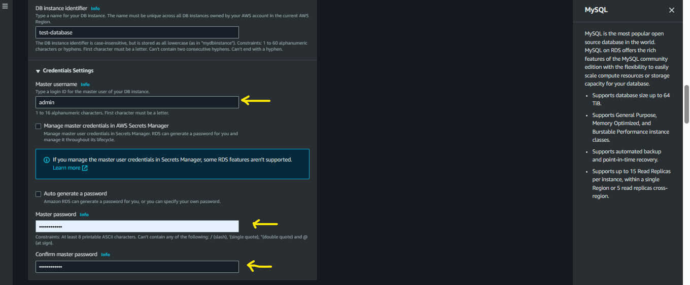

- In Storage make sure to **uncheck** `Enable storage autoscaling`

   

- **Important**: In **Connectivity** make sure you choose the correct values

  - **VPC**: `Default VPC`
  - **Subnet group**: `default`
  - **Public access**: `Yes`
  - **VPC Security Group**: `Choose existing`
    - **Remove** `default`
    - **Add** the security group created in the previous step (`pgsql-sg`)
  - **Availability Zone**: `No preference`
  - **Additional configuration**:
    - **Database port: `3306`**

  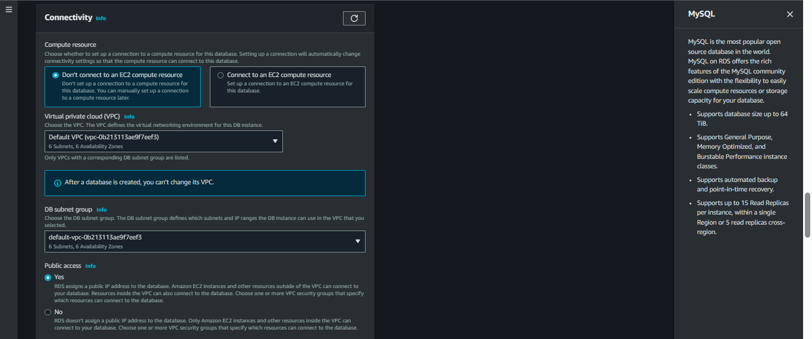

  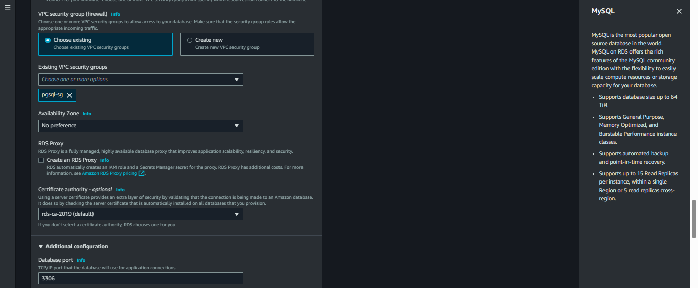

- In **Database authentication** choose `Password authentication`
  
    

- **Important**: Open the Additional configuration card

  - In Database options set **Initial database name** to a value (`test`)

  - Optional: You can disable **Encryption**, **Backup**, **Monitoring**, and other checked features
    
    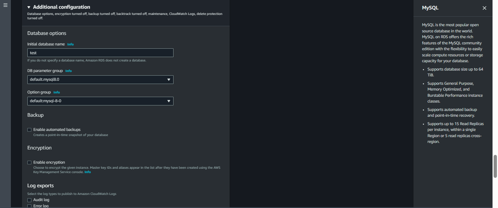

    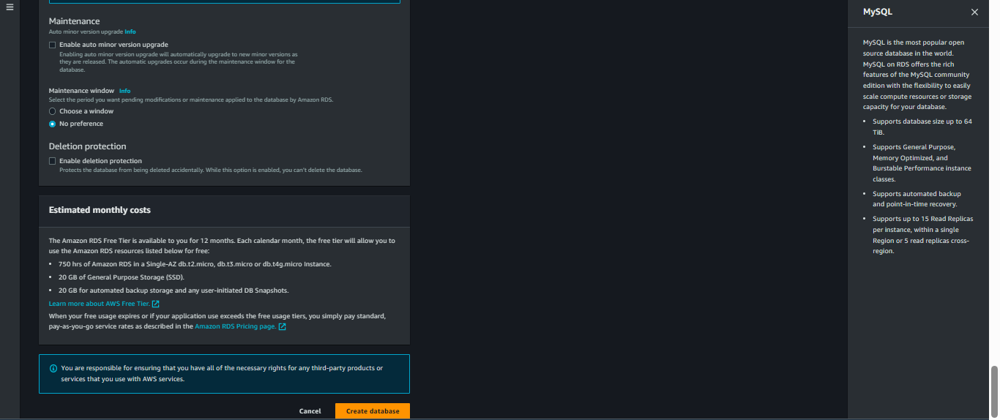

- Finally, create a database

If you checked Auto generate password you'll have a prompt with a blue ribbon in the next page

Click on `View credentials settings` and save the username and password in a safe location.

## Step 2: Create a Public EC2 Instance

Navigate to the ec2 console and click on Launch Instance

Write the name of your instances, and select Ubuntu as choice of Linux Distro.

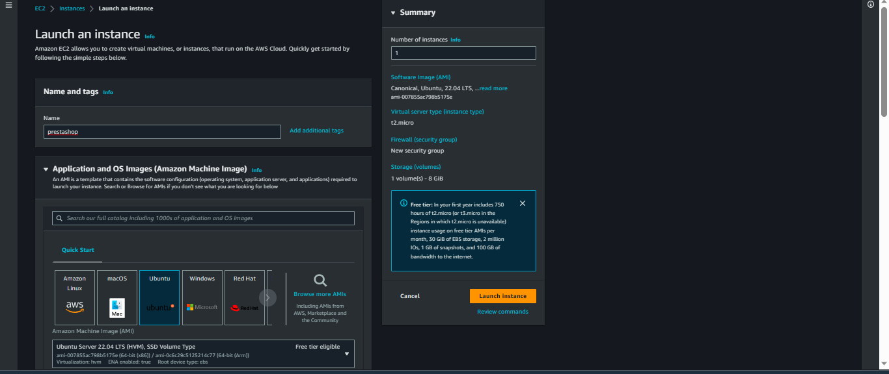

Select your `key-pair` if you don't have a key-pair create one

In `Connectivity`, make sure you choose the correct values for your customized VPC **OR** use `default VPC`, and choose any of the public subnet, Enable Auto-Assigned Public IP, and finally Create a Security Group keeping the default settings then click on Launch Instance.

## Security Group for EC2 instance traffic

- On AWS Management Console navigate to `EC2` > `Security Groups` > `Create security group`

- Add an inbound rule for `All TCP` from `Anywhere` (basically Protocol: `TCP`, Port: `0-65536`, Source: `0.0.0.0/0`)

  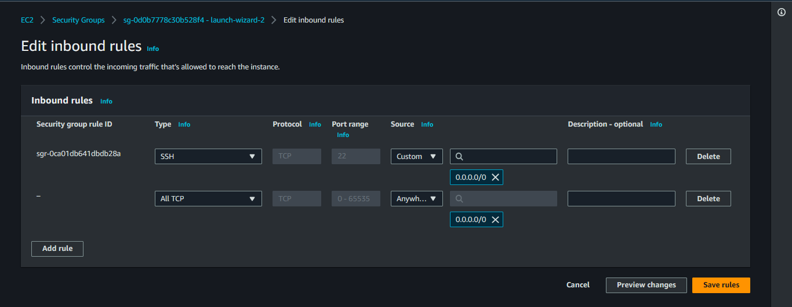

- Leave everything else as it's and click create

## Step 3 : Connect to EC2 instance

On the EC2 console Select the Instance you created and click on connect which will launch a Dashboard

Select SSH client and follow the instructions on how to connect.

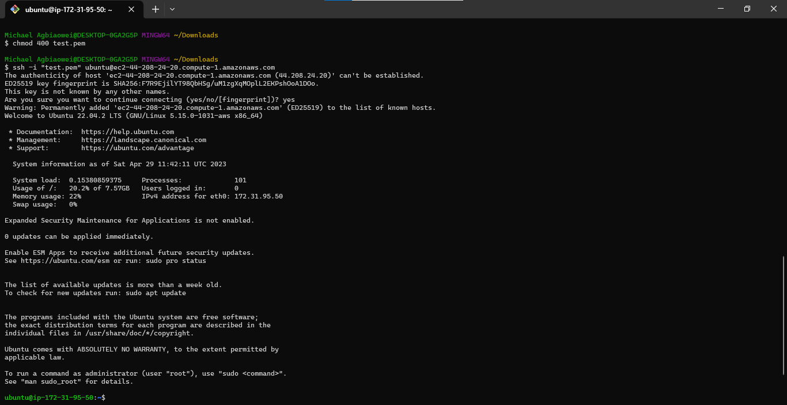

## Step 4 : Update system and install Apache Webserver

To begin, update the package manager cache

    sudo apt update; sudo apt install apache2 -y

## Step 5 : Install PHP7.4

    sudo apt install software-properties-common; sudo add-apt-repository ppa:ondrej/php; sudo apt update; sudo apt-get install -y php7.4 php7.4-cli php7.4-zip php7.4-json php7.4-common php7.4-mysql php7.4-gd php7.4-mbstring php7.4-curl php7.4-xml php7.4-bcmath php7.4-simple php7.4-intl

## Step 6 : Connect to AWS RDS using the Endpoint and Create Database

    sudo apt install mysql-client

    sudo mysql -h test-database.c4v46hctkald.us-east-1.rds.amazonaws.com -u admin -p
---

    create database db;
    show databases;
    exit

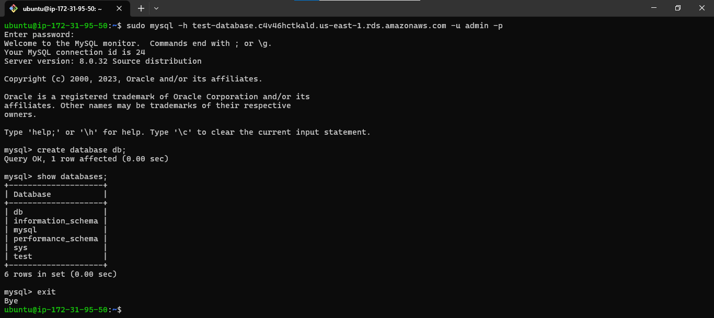

## Step 7 : Install Prestashop Version 1.7.8.8

Download the zip file and then unzip the downloaded file.

    cd /var/www/html; sudo curl -LO https://www.prestashop.com/en/system/files/ps_releases/prestashop_1.7.8.8.zip; sudo apt install unzip; ls; sudo unzip prestashop_1.7.8.8.zip

After unzipping the downloaded file, you will get prestashop.zip, and then you can store it in /var/www/html

    sudo unzip prestashop.zip; ls

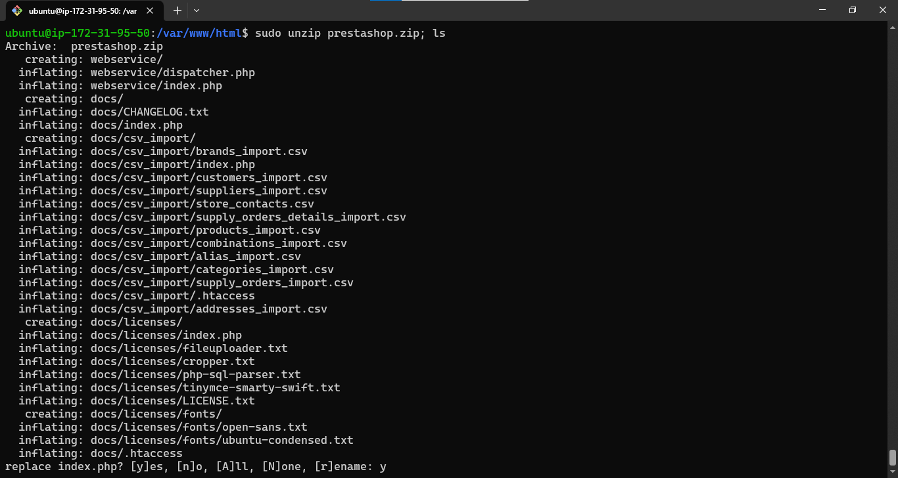

The directory permissions need to be set accordingly

    sudo chown -R www-data:www-data /var/www/html/; sudo chmod -R 755 /var/www/html/; sudo a2enmod rewrite; sudo systemctl restart apache2.service; sudo rm -rf index.html

To complete the installation, go to http://yourpublicipaddress

## Step 8 : Choose your language then click Next

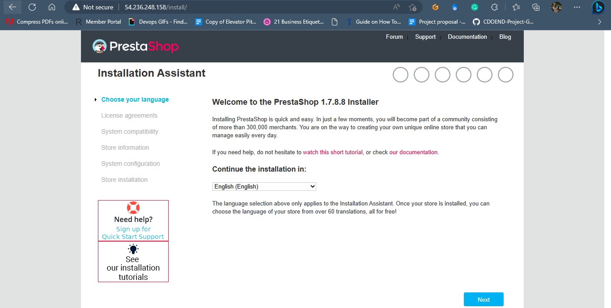

## Step 9 : Click "Next" after agreeing to the terms and conditions.

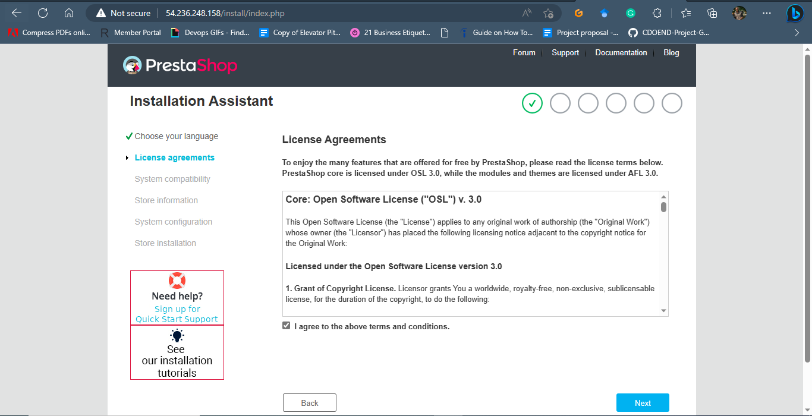

## Step 10 : Add information about your store

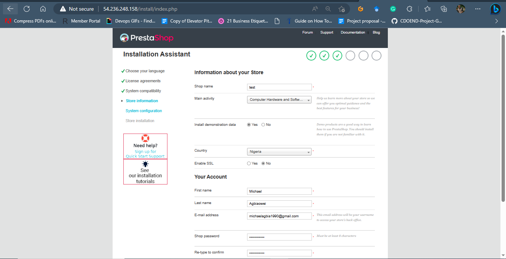

To enable SSL for your e-commerce website, you need to enable SSL

## Step 11 : Configure your database with the credentials you created when creating your AWS RDS and test the connection

After installation, a window will appear

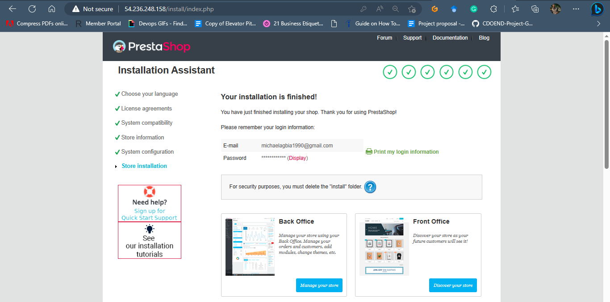

Finally, close the window and revist your your ste using http://yourpublicaddress

---

## 🔗 Contacts

## MICHAEL AGBIAOWEI

